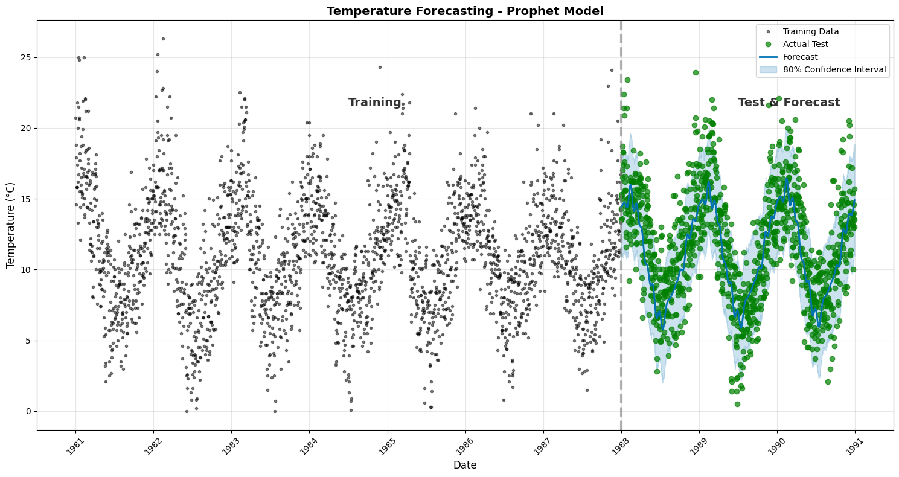

# Time-Series Forecasting with GridDB and Meta's Prophet 

Welcome to the **Time-Series Forecasting** project! This repository demonstrates how to build a robust pipeline for forecasting daily minimum temperatures using **GridDB**, a high-performance NoSQL database, and **Meta’s Prophet**, an open-source forecasting model. Whether you're a data scientist, developer, or IoT enthusiast, this project offers a hands-on way to explore time-series analysis with cutting-edge tools.

## 🌟 Project Overview

This project leverages the [Daily Minimum Temperatures dataset](https://www.kaggle.com/datasets/suprematism/daily-minimum-temperatures) (1981–1990) to:
- Store and manage time-series data in **GridDB**.
- Preprocess data using **Pandas** for compatibility with Prophet.
- Build and train a forecasting model with **Meta’s Prophet**.
- Evaluate performance using **MAE** and **RMSE** metrics.
- Visualize results with **Matplotlib** and **Seaborn**.

**Key Results**:
- Mean Absolute Error (MAE): ~2.09°C
- Root Mean Squared Error (RMSE): ~2.67°C
- Accurate capture of seasonal trends with an 80% confidence interval.

## 🛠️ Prerequisites

To get started, ensure you have the following installed:
- Python 3.8+
- GridDB C Client and Python Client ([Installation Guide](https://pypi.org/project/griddb-python/))
- Required Python libraries:
  ```bash
  pip install prophet seaborn numpy pandas scikit-learn matplotlib
  ```

## Quick Start

1. **Clone the Repository**:
   ```bash
   git clone https://github.com/your-username/time-series-forecasting-griddb.git
   cd time-series-forecasting-griddb
   ```

2. **Set Up GridDB**:
   - Install GridDB and configure the server (notification_member: `127.0.0.1:10001`, cluster: `myCluster`, user: `admin`, password: `admin`).
   - Create a time-series container:
     ```python
     import griddb_python as griddb
     factory = griddb.StoreFactory.get_instance()
     gridstore = factory.get_store(
        notification_member = "127.0.0.1:10001",
        cluster_name = "myCluster",
        username = "admin",
        password = "admin"
      )
     coninfo = griddb.ContainerInfo("Daily-Temp", [["Date", griddb.Type.TIMESTAMP], ["Daily-minimum-temperatures", griddb.Type.FLOAT]], type=griddb.ContainerType.TIME_SERIES)
     gridstore.put_container(coninfo)
     ```

3. **Run the Jupyter Notebook**:
   - Open `timeseries-using-griddb.ipynb` in Jupyter.
   - Follow the step-by-step code to load data, store it in GridDB, train the Prophet model, and visualize results.

4. **Explore the Results**:
   - Check the output visualizations for training/test data and forecasts.
   - Review the model performance metrics (MAE, RMSE).

## 📊 Key Features

- **Data Storage**: Efficiently store time-series data in GridDB’s optimized time-series container.
- **Preprocessing**: Clean and transform data using Pandas for Prophet compatibility.
- **Forecasting**: Leverage Prophet’s additive model to capture daily and yearly seasonality.
- **Evaluation**: Quantify model accuracy with MAE and RMSE.
- **Visualization**: Generate insightful plots to compare actual vs. predicted temperatures.

## 📈 Example Output

Here’s a glimpse of the forecasting results:


The plot shows the training data, test data, and predicted temperatures with an 80% confidence interval, highlighting the model’s ability to capture seasonal patterns.

## 💡 Why This Project?

- **Learn GridDB**: Dive into a high-performance NoSQL database tailored for time-series and IoT data.
- **Master Prophet**: Understand how to apply Meta’s Prophet for robust time-series forecasting.
- **Real-World Application**: Apply the pipeline to other time-series problems like energy consumption or financial forecasting.

## 🤝 Contributing

We’d love your contributions! Here’s how to get involved:
1. Fork the repository.
2. Create a feature branch (`git checkout -b feature/YourFeature`).
3. Commit your changes (`git commit -m 'Add YourFeature'`).
4. Push to the branch (`git push origin feature/YourFeature`).
5. Open a Pull Request.

Have questions or ideas? Open an issue or tag us on [Stack Overflow with `griddb`](https://stackoverflow.com/questions/ask?tags=griddb).

## 📚 Resources

- [GridDB Documentation](https://griddb.net/)
- [Prophet Documentation](https://facebook.github.io/prophet/)
- [Daily Minimum Temperatures Dataset](https://www.kaggle.com/datasets/suprematism/daily-minimum-temperatures)
- [Blog Post](blog.md) for a detailed walkthrough

## 🌍 Connect with Us

- Share your results or ask questions on [Stack Overflow](https://stackoverflow.com/questions/ask?tags=griddb).
- Follow me on [LinkedIn](https://www.linkedin.com/in/your-profile/) for updates on data science and IoT projects.
- Star ⭐ this repository to show your support!

Let’s explore the power of time-series forecasting together! 🚀
